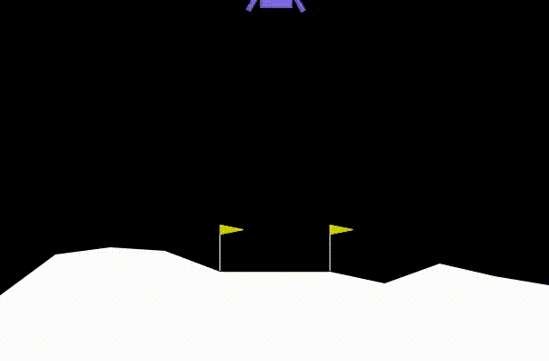

# Deep Q-Learning for Lunar Lander

Short one-line description:
DQN agent trained on OpenAI Gym's LunarLander-v2; includes training notebook, plots, and demo.

## Highlights
- Deep Q-Network with experience replay & target network
- Training curves and evaluation
- Demo video / GIF of the trained agent

## Files
- `DeepQ_LunarLander.ipynb` — main notebook (training + evaluation)
- `models/` — (optional) saved model checkpoints (not committed if large)
- `demo.gif` — short gameplay

## Requirements
Python 3.8+, PyTorch, gym, numpy, matplotlib

## How to run
1. Create virtual env: `python -m venv venv && source venv/bin/activate`  
2. Install: `pip install -r requirements.txt`  
3. Open notebook or run training script

## Results
## Demo
<video src="Lunar-Lander.mp4" controls width="600"></video>

## License
MIT

Update README with project description
